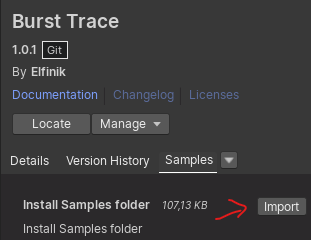
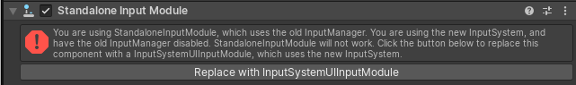

> 詳細なドキュメントは開発中です



使用例を確認したい場合は、サンプルフォルダをインポートできます。

Samples シーンを開いてください。

Entities パッケージがインストールされている場合は、`ECS/ECS Samples` にあるサンプルを開くことができます。

注意！ Unity 6+ でサンプルを実行すると、コンソールに次のエラーが表示される場合があります：
```
InvalidOperationException: You are trying to read Input using the UnityEngine.Input class, but you have switched active Input handling to Input System Package in Player Settings.
```
エラーをクリックすると、シーン内の `EventSystem` オブジェクトがハイライトされます。インスペクターにある **Replace with InputSystemUIInputModule** ボタンをクリックしてください。これにより、古い入力コンポーネントが新しい Input System と互換性のあるものに置き換わります。


Unity 6 では、テキストフィールドのテキスト内にリンクが含まれます（リッチテキストタグ）。これは Unity 6 でのリンク処理の変更によるものです。これは機能には影響しません。古いバージョンとの互換性を保つため、デモシーンでは更新されていません。

`CustomThreads` シーンは、`System.Threading.Tasks` やその他のマルチスレッドフレームワーク（Job System 以外）からの動作例を示しています。