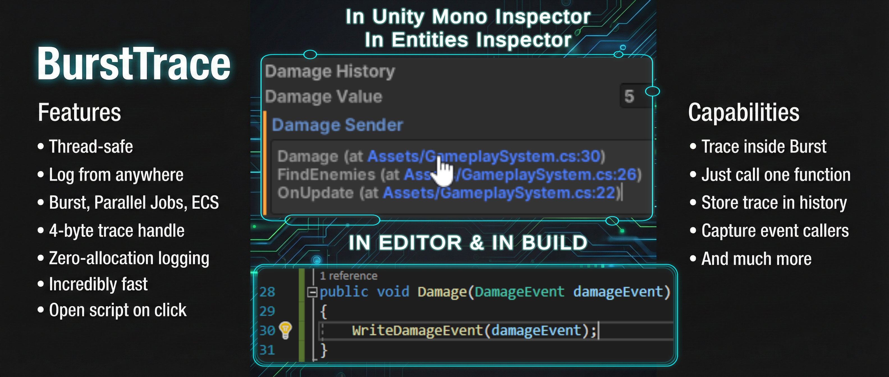
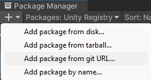
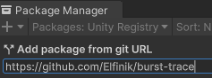
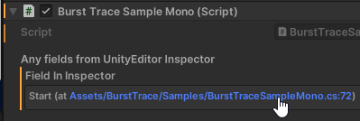
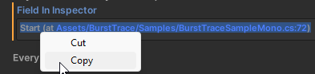
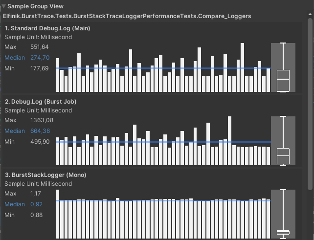
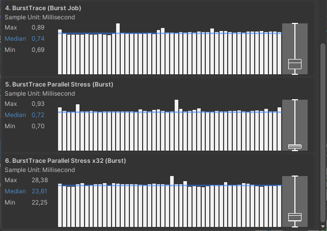
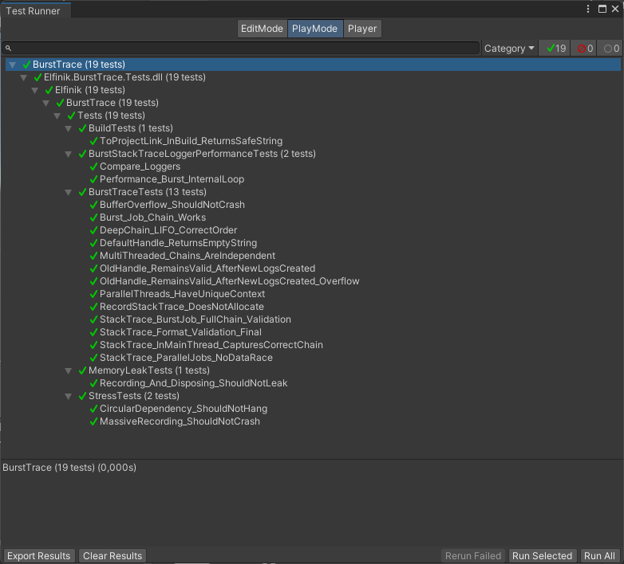
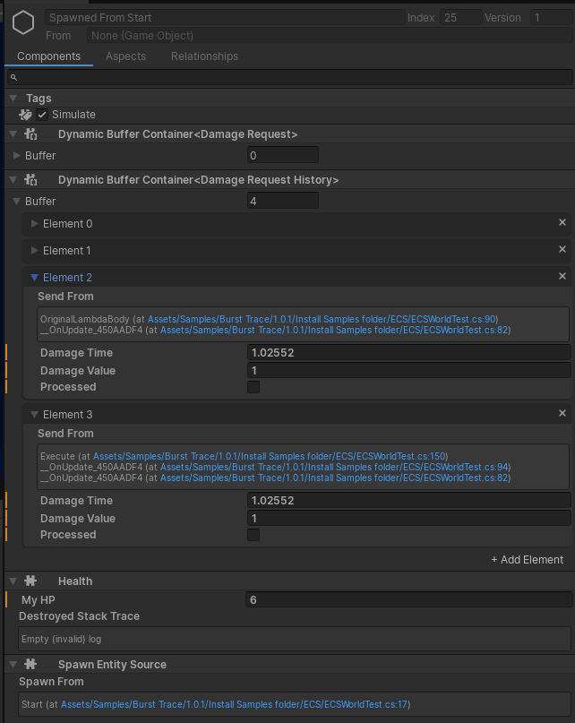

- [クイックスタート (Quick Start)](#クイックスタート) 
- [パフォーマンステスト (Performance Tests)](#パフォーマンステスト) 
- [ECS 統合 (任意)](#ecs-統合) 
- [ドキュメント (高度な使用法)](Documentation~/Advanced_Usage.md) 
- [API](Documentation~/API-DOCS.md) 
- [サンプル (Unity 6+ で実行する場合)](Documentation~/Samples.md) 
- [System.Threading.Tasks での使用](Documentation~/Multithreading-No-Unity-Jobs.md)

- [English](README.md)
> **日本語ドキュメントは AI (Gemini) によって自動翻訳されたものです。不正確な点がある場合は、英語版を参照してください。**

# クイックスタート

<details>
<summary>Installation</summary>

## Package Manager 経由
- メニューから `Window` > `Package Manager` を開きます。
- 左上の `+` ボタンをクリックします。
- `Add package from git URL...` を選択します。



- 以下のリポジトリURLを入力してください：

```
https://github.com/Elfinik/burst-trace.git
```


- `Add` をクリックします。

## Via OpenUPM 
The package is available on the [openupm registry](https://openupm.com/packages/com.elfinik.burst-trace). It's recommended to install it via [openupm-cli](https://github.com/openupm/openupm-cli).

```
openupm add com.elfinik.bursttrace
```

## または `manifest.json` 経由 (Or via manifest.json)
プロジェクトフォルダ内の `Packages/manifest.json` を開き、`dependencies` スコープに以下の行を追加してください：

```
"com.elfinik.burst-trace": "https://github.com/Elfinik/burst-trace.git"
```
---

</details>

スクリプトの冒頭に名前空間を追加します：
```CSharp
using Elfinik.BurstTrace;
```
スタックをキャプチャするには、以下のメソッドを呼び出します：
```CSharp
traceHandle = TraceHandle.Capture();
```
これは `TraceHandle` 構造体を返します。この変数は自由に渡したり保存したりできます。 MonoBehaviour インスペクター (GameObject / ScriptableObject) や Entity インスペクターでは、この変数からの呼び出しチェーンが表示されます：

>各ログはクリック可能です：行をクリックすると、スクリプトの該当行が開きます。 Unity では、ハイパーリンクをたどるためにダブルクリックやトリプルクリックが必要な場合があります。ログをコピーすることも可能です（下のスクリーンショットを参照）。



変数が空の場合、`Empty (Invalid) log` と表示されます。 現在は1行のみ記録されています。複数行のパス（呼び出し経路）を記録したい場合は、前の値を渡して関数を呼び出すだけです：
```CSharp
traceHandle = TraceHandle.Capture(traceHandle);
//or
traceHandle = TraceHandle.Capture(prevTraceHandle);
```
これで2行表示されます。何行でも保存できますが、`TraceHandle` は常に4バイトしか消費しません。 **ただし注意してください：表示および出力時には最大64行までしか表示されません！ これは最適化と無限ループ防止のためです。** 呼び出しチェーンをコンソールに出力したい場合は、次のように呼び出します：
```CSharp
Debug.Log(traceHandle.ToProjectLink());
```
これにより、インスペクターと同じテキストがコンソールに出力されます。これもクリックしてファイルを開くことができます。
>[!NOTE] 
>コンソールウィンドウでは、ログリスト内のハイパーリンクを直接クリックできないことに注意してください。まずログを選択し、下部のパネルでテキストをクリックする必要があります。

何らかの理由で Burst コード内からコンソールにログを出力する必要がある場合は、次のように呼び出します：
```CSharp
Debug.Log(traceHandle.ToConsoleToken());
```
この関数は、内部にハイパーリンクを持つ `FixedString128Bytes` を返します。コンソールには `CLICK TO PRINT LOG` と出力されます。ハイパーリンクをクリックすると、完全な呼び出しチェーンを含むログが出力されます。
>[!TIP] 
>PlayMode（プレイモード）を停止しても、リンクを取得してインスペクターでログを確認することは **次の PlayMode が開始されるまで** 可能です。再起動後、前回の実行時のログはすべて無効になり、出力は未定義になります。

# ビルドでの動作 (Work in Build)
BurstTrace はエディタとビルド（Build）の両方で動作します。ビルドでは、ハイパーリンクの代わりにファイルの **完全なパス (Full Path)** が表示されます。必要に応じて、このデータを分析システムやログシステムに送信できます。
# コードジェネレーターや DLL はありますか？
いいえ。すべてのコードは完全に公開されており、それ自体はいかなるジェネレーターも使用していません（ただし、コンパイル時に呼び出しパスを取得するために標準的な C# コンパイラ機能を使用しています）。
# 制限事項
- **初期化：** `Awake` の後、最初にロードされたシーンの `Start` の前に発生します。
- **ユニークレコード制限：** 1,048,575。
	- ユニークレコードとは、スクリプトファイル内の関数呼び出しのことです。ループ内で関数を何度も呼び出したとしても、スクリプト内で同じ行であれば、それは1つのユニークレコードとしてカウントされます。
- **ネストされたレコード制限：** +1,048,575。 
	- ユニークなネストログ：これはユニークなログチェーンを指します。つまり、ループ内で15個のログチェーンを作成した場合、1つのユニークログと15個のユニークなネストログが作成されます。
- **最大スレッド数：** メインスレッド1つ + 2047（標準の Unity は128に制限されているため、カスタムフレームワーク用に余裕を持たせています）。
- **呼び出し場所：** どこからでも（メインスレッド、Burst、マルチスレッド Jobs）記録を呼び出せます。これはパフォーマンスに影響しません。ただし、スレッド管理にカスタムフレームワークを使用している場合、関数を安全に呼び出すことはできません。JobSystem を使用していない場合は、「System.Threading.Tasks での使用」セクションを参照してください。
- **シリアル化：** 現在、セッション間の `TraceHandle` のシリアル化はサポートされていません。アプリケーションを再起動すると、古い `TraceHandle` は無効になります。
# System.Threading.Tasks での使用
Unity JobSystem 以外（例：C# Threading）で BurstTrace をマルチスレッドで使用したい場合は、別の手順に従ってください： [Unity Jobs 以外での使用](Documentation~/Multithreading-No-Unity-Jobs.md)

# Debug.Log および StackTrace との比較
BurstTrace：これは、どこでも保存して動作させることができるログを作成するための非常に高速な方法です。その代わり、呼び出しチェーン全体を自動的に作成することはできません。

|                 | パフォーマンス                                       | Burst          | StackTrace            |
| --------------- | --------------------------------------------- | -------------- | --------------------- |
| BurstTrace      | 非常に高速                                         | 完全互換           | 各行を記録する必要がある          |
| Debug.Log       | 約200倍遅いが、単発の呼び出しには十分高速                        | 部分的に互換         | 完全な StackTrace をログに出力 |
| StackTrace (C#) | 非常に遅い。`ToString()` の呼び出しが必要で、これもリソースを消費する操作です | 非互換 (マネージドクラス) | 内部に完全な StackTrace を保持 |

要約すると：
- 完全なログ出力をコンソールに表示する必要があり、履歴に保存する必要がない場合は、`Debug.Log` を呼び出してください。それほど速くはありませんが、StackTrace 全体を即座にキャプチャします。
- マネージド C# コード内で完全な StackTrace を保存する必要がある場合は、`StackTrace` クラスを使用できます。遅いですが、StackTrace 全体を即座に記録して保存します。参照型（クラス）であるため、頻繁にインスタンス化するとガベージコレクタ（GC）に負荷がかかり、遅延やパフォーマンススパイクの原因になります。
- Burst コード内でチェーンや呼び出し場所を保存する必要がある場合：BurstTrace だけが適しています。
- エンティティ（Unity ECS）でチェーンや呼び出し場所を保存したい場合：BurstTrace だけが適しています。
- 通常の C# コードで最大のパフォーマンスが必要で、StackTrace を記録したいすべての呼び出し場所で関数を呼び出すことができる場合、BurstTrace を使用してください。数千のログを記録する際、驚異的なパフォーマンス向上をもたらします。
# パフォーマンス:
標準の Unity ツール（メインスレッドまたは JobSystem）内での呼び出しは完全にスレッドセーフです。競合状態（レースコンディション）はなく、Interlock 呼び出しもなく、すべてのコードは Burst 互換です。

1回の記録にかかる時間は約：0.002 - 0.005ms（Unity の安全性チェックが有効な場合）。

コンソール出力は非常に高速ですが、あくまでデバッグ機能です。

# パフォーマンステスト
500回のログイベント呼び出し（結果は ms 単位）：

|                                 | Min   | Median | Max   |
| ------------------------------- | ----- | ------ | ----- |
| Standard Debug.Log              | 177   | 274    | 552   |
| Debug.Log (Burst Job)*          | 488   | 664    | 1316  |
| BurstTrace (Mono)               | 0.88  | 0.92   | 1.17  |
| BurstTrace (Burst Job)          | 0.69  | 0.74   | 0.89  |
| BurstTrace (Parallel Job)       | 0.7   | 0.72   | 0.93  |
| BurstTrace (Parallel Job x32)** | 28.38 | 23.61  | 22.25 |

テストでは、BurstTrace ログを単に500回呼び出すのではなく、500個のログからなるチェーンを作成しています。つまり、キャッシュされた値を使用するのではなく、新しいログが毎回新しいものとして作成され、チェーンを形成します。

\* 結果はテストごとに大きく異なります：最大値は約 800 ～ 1400 ms です。

\** ログ呼び出し自体が非常に高速であるため、ジョブのスケジューリング自体がテストに大きな影響を与えます。そのため、最後のテストは他のテストの32倍の反復回数で実行されています。




`Debug.Log` テストの負荷は、ログをコンソールに出力することにも起因しており、これにより明らかに巨大な負荷が追加されます。

# メモリ
`TraceHandle` ポインタ自体は4バイトしか占有しませんが、文字列自体はテキストとして保存する必要があります。

1つのユニークなレコードは、平均して 1 ～ 20 KB を消費します。
> メインスレッドからログを作成する場合、または1回だけ作成する場合、レコードは 1 KB を占有します。 マルチスレッド Job からログを作成し、それを何度も実行する場合、最大 20 KB、または非常に多くのスレッドを持つデバイスではそれ以上を占有する可能性があります。

1つのユニークなネストされたログレコード（チェーン）も、約 16 ～ 320 バイトを占有します。

デフォルトでは 20MB のメモリが割り当てられており、これは 1024 行のログを記録するのに十分です。この値は `ProjectSettings > BurstTrace` で変更できます（例：モバイルプラットフォーム向けに値を減らすなど）。

# ユニットテスト


プロジェクト内でユニットテストを表示および実行できます。注意：テストが無限に実行される場合があります。その場合はキャンセルして再実行してください。これはユニットテスト内で JobSystem を実行することに関連するバグのようです。通常、この場合コンソールに Warning メッセージが表示されます。

一部のテストは重く、エディタが数秒間（デバイスが非常に弱い場合は数分間）フリーズする可能性があります。

# ECS 統合

|  | **自動サポート：** 追加の設定なしで ECS でこのパッケージを使用できます。`TraceHandle` は Entity インスペクターに正しく表示されます。<br> |
| --------------------------------------------------------- | -------------------------------------------------------------------------------------- |
# ライセンス (MIT) / License (MIT)
This project is licensed under the **MIT License**.

You are free to use this library in personal and commercial projects.

**⚠️ Restriction on Resale:** While the MIT license permits commercial use, **you are not allowed to resell this source code as a standalone asset** (e.g., on the Unity Asset Store or similar platforms) without substantial modification or added value. The intent of this license is to allow developers to use the tool in their games/apps, not to enable asset flipping.

See the [LICENSE](LICENSE) file for the full text.
# Credits
**Core Implementation** The core code is **hand-written** and based on my personal R&D over the last year. It utilizes internal APIs from `Unity.Collections` and `Unity.Entities` (for the Inspector integration).

**AI Assistance** The following components were generated with the assistance of **Google Gemini** (with manual review and refinement):

- Unit Tests
- Demo Scripts
- Documentation & Code Comments
- Logo design